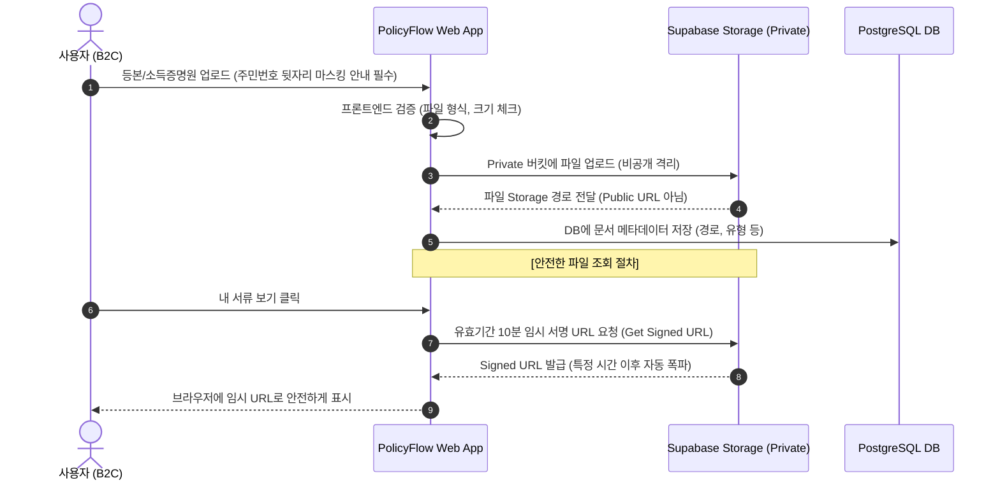

# 🏛️ Legal Compliance & Commercialization Risk Report
## PolicyFlow AI — 법적 규제 준수 및 상업적 수익화 가능성 진단 보고서

이 보고서는 **PolicyFlow AI** 프로젝트의 현재 설계 및 구현 상태를 바탕으로, 외부 API 연동, 웹 데이터 수집, 개인 행정 서류 보관(Storage), AI 파싱 기술 도입, 그리고 상업적 수익화 모델(B2C Premium, B2G SaaS) 운영 시 발생할 수 있는 **법률적 쟁점과 해결 방안(Mitigation)**을 한국 법률(개인정보 보호법, 공공데이터법, 부정경쟁방지법, 전자상거래법 등)에 근거하여 심층 분석한 결과입니다.

---

## 📌 Executive Summary (요약)

1. **공공 API 및 데이터 사용 (합법)**: 공공데이터포털(data.go.kr), 온통청년, 기업마당 등 정부 공공데이터는 **공공데이터법 제26조**에 의거, **상업적 목적으로 자유롭게 이용하는 것이 완전히 합법**입니다.
2. **치명적인 개인정보보호법 리스크 (주의 및 즉각적 수정 필요)**:
   - 사용자가 주민등록등본, 초본, 소득금액증명원 등 정부 서류를 업로드할 때 **주민등록번호 뒷자리(7자리)가 포함된 원본이 가려지지 않고 그대로 노출되거나 보관되는 것은 개인정보 보호법 제24조의2(주민등록번호 처리의 제한)에 의해 명백한 위법**입니다. (사용자 동의가 있어도 수집 불가능)
   - Supabase Storage에서 파일 조회를 **Public URL로 제공하는 현재 구조** 역시 개인 식별 정보 노출에 취약하므로 **Private Bucket 전환 및 Signed URL(임시 서명 링크) 체계로 즉시 전환**해야 합니다.
3. **AI 파서 및 환각(Hallucination) 책임 소지**: AI가 공고문을 파싱하거나 자격 요건을 잘못 매칭하여 사용자가 지원 기회를 놓치거나 오인 신청했을 때의 손해배상 리스크를 줄이기 위해, 서비스 가입 단계 및 추천 대시보드 내에 **강인한 면책 고지(Disclaimer)와 최종 확인 책임 약관**을 배치해야 합니다.
4. **상업적 수익 모델 및 신고 요건**: 유료 비즈니스나 대행 수수료 청구 모델을 정식 론칭할 경우 **부가통신사업자 신고** 및 **통신판매업 신고**가 필수이며, 정책 대상 중 금융 상품(예: 적금, 청약 등) 가입을 플랫폼 내에서 알선/중개/대행하는 행위는 **금융소비자보호법**에 저촉될 수 있으므로 **단순 정보 제공 및 외부 공식 링크 리다이렉트 방식**을 고수해야 합니다.

---

## 1. 공공 API 및 외부 데이터 수집의 적법성

### 1.1 공공데이터의 상업적 이용 및 법적 근거
PolicyFlow AI가 연동하고 있는 **공공데이터포털(data.go.kr)** 및 **온통청년 API**, **기업마당(Bizinfo) API** 등은 정부가 민간 혁신 성장을 지원하기 위해 개방한 데이터 소스입니다.

*   **법적 근거**: **공공데이터의 제공 및 이용 활성화에 관한 법률(약칭: 공공데이터법) 제26조(공공데이터의 상업적 이용 등)**
    > *"누구든지 공공기관이 제공하는 공공데이터를 영리적 목적으로 이용할 수 있다. 공공기관의 장은 제공 대상 공공데이터에 대하여 영리적 목적의 이용을 포함한 이용권한을 이용자에게 부여하여야 한다."*
*   **결론**: 공공기관 API를 수집하여 자격 진단 매칭을 제공하고, 이를 통해 상업적 수익(광고, 프리미엄 멤버십, 수수료 등)을 올리는 것은 **법적으로 100% 합법이며 국가가 장려하는 사항**입니다.

### 1.2 웹 크롤링/스크래핑 관련 리스크 (지자체 고시공고 등)
API로 제공되지 않는 개별 지자체의 신설 정책이나 고시공고를 웹 크롤러를 통해 백그라운드 수집하는 행위입니다.

*   **저작권법 쟁점**: 정부 및 지자체의 법령, 조례, 고시, 공고 등은 **저작권법 제7조(보호받지 못하는 저작물)**에 해당하여 누구나 저작권 침해 걱정 없이 자유롭게 이용할 수 있습니다.
*   **부정경쟁방지법 및 데이터베이스권 쟁점**: 
    - 다만, 지자체나 특정 공공 포털 사이트의 전체 구조를 통째로 긁어오거나, 지나치게 빠른 속도로 크롤링하여 상대방 서버에 과부하를 주는 행위는 **업무방해(형법)** 또는 타인의 상당한 투자와 노력으로 만들어진 성과를 무단 도용하는 **부정경쟁방지법 제2조 제1호 (카)목(성과물 무단 도용)**에 저촉될 수 있습니다.
*   **대비책 (Mitigation)**:
    1.  대상 서버의 `robots.txt` 정책을 반드시 확인하고 준수합니다.
    2.  크롤러 작동 시 **Rate Limiting(요청 속도 제한, 예: 1~2초당 1회)** 및 **새벽 시간대 배치 스케줄**을 적용하여 공공 서버 부하를 최소화합니다.
    3.  가능한 한 공식 OpenAPI를 최우선으로 활용하고, 크롤링은 보조적 수단으로만 사용합니다.

### 1.3 출처 표시 의무 및 라이선스 준수
정부 데이터 활용 시 공공누리(KOGL) 또는 국가 소유 저작물 가이드에 따라 **출처를 명시**하는 것이 좋습니다.
*   **대비책 (Mitigation)**:
    - 정책 상세 보기 하단 또는 어바웃 페이지 등에 다음과 같은 문구를 명시합니다.
    > *"본 정책 정보는 [공공데이터포털 / 온통청년 API / 기업마당]의 데이터를 기반으로 구조화하여 제공되며, 출처는 각 정부 부처 및 지자체입니다."*

---

## 2. [CRITICAL] 개인정보 보호법 및 서류 보관 리스크

현재 PolicyFlow AI의 **Document Manager (Policy Wallet)** 및 프로필 관리 모듈은 심각한 법적 제재를 받을 수 있는 **치명적인 위반 리스크**를 안고 있습니다. 법적 안정성을 확보하기 위해 아래 분석을 따르는 즉각적인 아키텍처 개편이 요구됩니다.



### 2.1 주민등록번호 처리의 절대적 제한 (개인정보 보호법 제24조의2)
사용자가 `주민등록등본`, `주민등록초본`, `소득금액증명원`, `임대차계약서` 등을 스캔/촬영하여 업로드할 때, 해당 서류에는 **고유식별정보인 주민등록번호 전체(13자리)**가 포함되어 있습니다.

> [!CAUTION]
> **주민등록번호는 사용자의 동의를 구하더라도 법률·시행령·시행규칙에 구체적인 근거가 명시된 법적 주체(금융사, 공공기관, 세무대리 등)가 아닌 이상 절대 수집·보관·처리가 불가능합니다. 일반 민간 플랫폼이 이를 원본 그대로 보관하는 행위는 예외 없이 100% 불법입니다.**
> 
> *   **위반 시 처벌**: **개인정보 보호법 제24조의2 제1항** 위반으로 **3천만 원 이하의 과태료** 또는 **5년 이하의 징역, 5천만 원 이하의 벌금**에 처해질 수 있으며, 유출 시 매출액의 3% 이하에 상당하는 **징벌적 과징금**이 부과될 수 있습니다.

*   **대비책 (Mitigation)**:
    1.  **프론트엔드 UI 가이드 및 경고 삽입**: 파일 업로드 영역 상단에 빨간색 경고 문구를 명시하고, 파일 업로드 버튼 클릭 시 팝업을 통해 경고를 제공해야 합니다.
        > *"⚠️ 개인정보 보호법에 따라, 모든 증빙 서류 업로드 시 **주민등록번호 뒷자리 7자리**는 반드시 마스킹(검게 지우거나 가림) 처리 후 업로드해 주셔야 합니다. 마스킹 되지 않은 서류는 발견 즉시 즉각 파기됩니다."*
    2.  **AI OCR 기반 자동 마스킹 (중장기)**: 백엔드에서 서류를 수집하는 즉시 OCR(Optical Character Recognition)을 가동하여 `\d{6}-\d{7}` 패턴의 주민등록번호를 탐지하고 뒷자리를 블랙 마스킹 처리하여 스토리지에 저장하는 솔루션(예: Google Cloud Document AI, Clova OCR 등)을 도입해야 합니다.
    3.  **최소 보관의 법칙**: 서류 보관 기간을 설정하여, 사용자가 신청 과정을 완료하거나 일정 기간(예: 3개월)이 지나면 스토리지 및 DB에서 **물리적으로 자동 영구 삭제**하는 라이프사이클 관리 정책을 구현합니다.

### 2.2 Supabase Storage 보안 아키텍처 결함 및 해결 방안
현재 `wallet/page.js` 코드 165~167라인을 보면, 업로드된 파일의 **Public URL**을 가져와서 DB 테이블에 그대로 보관하고 브라우저에 배포하고 있습니다.
```javascript
// 현재 문제점 코드: Public URL 발급
const { data: { publicUrl } } = supabase.storage.from("policy-documents").getPublicUrl(filePath);
```

> [!WARNING]
> 버킷이 Public 상태이거나 Public URL 형태로 DB에 저장될 경우, 해당 주소(URL)는 고유하지만 암호화되어 있지 않아 **URL이 외부로 유출되거나 무작위 대입(brute force) 공격에 노출되면 로그인하지 않은 비인간 제3자도 민감한 등본 서류를 다운로드할 수 있는 파탈적인 개인정보 유출 사고**로 이어질 수 있습니다.

*   **대비책 (Mitigation)**:
    1.  **Private Bucket 설정**: Supabase Dashboard에서 `policy-documents` 스토리지 버킷의 Public 옵션을 해제하고 **Private Bucket**으로 강제 격리합니다.
    2.  **Signed URL (임시 서명 링크) 도입**: 사용자가 자신의 서류를 다운로드하거나 뷰어로 확인하고 싶을 때에만, **서버 측에서 유효기간(예: 5분~10분)이 한정된 보안 토큰이 서명된 임시 URL**을 발급받아 노출해야 합니다.
    ```javascript
    // 개선 방안 코드: Signed URL 발급 (유효기간 300초 = 5분)
    const { data, error } = await supabase.storage
      .from("policy-documents")
      .createSignedUrl(filePath, 300);
    const secureUrl = data.signedUrl;
    ```
    3.  **Row Level Security (RLS) 스토리지 정책 강제**: 스토리지의 버킷 레벨에서도 `auth.uid() = owner` 패턴의 RLS를 구성하여 타인의 폴더 경로(`{user_id}/fileName`)에 절대 읽기/쓰기 권한을 가질 수 없도록 차단합니다.

---

## 3. AI 연동 및 정보 신뢰도(환각) 관련 법적 책임

### 3.1 AI Parser 및 챗봇 오작동 책임
PolicyFlow AI의 핵심 경쟁력은 줄글 형태의 공고문을 AI(Gemini 등)가 해석하여 4축 스키마로 구조화하고, 사용자 프로필과 대조하여 **"적합도 점수(%)"**를 환각 없이 신속하게 연산해 내는 아키텍처에 있습니다.
그러나 거대언어모델(LLM)은 구조상 **환각 현상(Hallucination)**을 일으킬 확률이 0%가 될 수 없습니다.

*   **법적 리스크**: AI가 마감일, 소득 조건, 지원 금액을 잘못 파싱하여 사용자가 적합하다고 오인해 신청을 준비하다가 자격 미달로 최종 탈락하거나 마감을 놓친 경우, 이에 따른 기회비용 및 시간적 손해에 대해 플랫폼을 상대로 **손해배상 청구 소송**을 제기할 수 있습니다.

*   **대비책 (Mitigation)**:
    1.  **Draft-Publish 검증 파이프라인 (현재 V1 완비 상태)**: AI가 파싱한 데이터는 즉시 적용하지 않고 반드시 `status = 'draft'`로 임시 적재한 후, 인간 관리자가 한 차례 검수/컨펌하여 `status = 'published'`로 바꾸는 **Human-in-the-loop 검증 프로세스**를 정립하고 유지해야 합니다. 이는 AI의 완전 무결성 법적 책임을 "수정/보완된 최종 게시물" 형태로 전환해 리스크를 현격히 낮춥니다.
    2.  **이용약관(Terms of Service) 내 면책 조항(Disclaimer) 필수 배치**: 
        가입 화면 및 추천 결과 화면에 사용자가 시각적으로 인지할 수 있는 가독성 높은 폰트로 면책 문구를 명시해야 법적 방어권을 확보할 수 있습니다.
        > *"⚠️ **중요 면책 고지**: PolicyFlow AI가 제공하는 실시간 정책 진단 및 매칭 결과는 공공 API 데이터와 AI 기술을 기반으로 도출된 **참고용 진단 서비스**입니다. 정부 부처 및 지자체의 세부 요건 변경, AI의 일시적 오류 등으로 실제 수혜 자격 조건과 다소 차이가 있을 수 있으므로, **실제 신청 전에 반드시 해당 정책 주관 기관(예: 온통청년, 관할 지자체)의 공식 공고문을 재확인**하시기 바랍니다. 본 플랫폼은 진단 지표 상이로 인해 발생하는 간접적 손실에 대해 법적 책임을 지지 않습니다."*

### 3.2 AI API 데이터 제3자 제공 동기화 리스크 (Gemini 무료 API 기준)
*   **리스크**: Google AI Studio 무료 티어(Gemini API)를 사용하여 비구조화 텍스트 파싱을 돌릴 때, 만약 사용자의 이력서 텍스트, 프로필 정보, 혹은 서류 파일 원본 텍스트를 무가공 상태로 무료 API 프롬프트에 실어 나르게 된다면 구글의 모델 개선을 위한 프롬프트 리뷰 프로세스에 의해 **제3자에게 개인 행정 데이터가 유출되는 법적 문제**가 일어납니다.
*   **대비책 (Mitigation)**:
    - AI 구조화 파서는 오직 **정부 공고문 원본(공적인 비개인 데이터)**만을 입력값으로 받아 가공하는 데 한정되어야 합니다.
    - 만약 사용자 맞춤형 정책 컨설팅(AI Chat Advisor) 서비스를 제공하고자 사용자의 프로필(나이, 소득 등)이나 서류 내용을 AI API에 전달해야 한다면, 반드시 **데이터 보호 계약이 체결되어 학습에 데이터를 사용하지 않는 Google Cloud Vertex AI API** 또는 **AI Studio의 유료 기업 계정(Enterprise Tier)**을 가동하여 데이터 기밀성(Confidentiality)을 보장해야 합니다.

---

## 4. 상업적 수익 모델(Monetization) 구축 시 법적 요건

PolicyFlow AI를 통해 상업적 수익을 취하는 비즈니스 모델로 고도화할 시 직면하게 되는 행정 규제와 관련 법규 검토입니다.

### 4.1 부가통신사업 및 통신판매업 신고 의무
*   **부가통신사업 신고**: 인터넷망을 활용해 정보제공, 매칭, SaaS 등의 서비스를 영위하고 수익을 얻기 시작하면 **전기통신사업법 제22조**에 따라 과학기술정보통신부(관할 전파관리소)에 부가통신사업 신고를 마쳐야 합니다. (다만, 자본금 1억 원 이하의 개인 소규모 사업자는 신고 의무 면제 등 요건이 존재하므로 사업 개시 전 기준 확인 요망)
*   **통신판매업 신고**: 플랫폼 내에서 유료 프리미엄 멤버십 결제를 유도하거나 유료 서류 대행 서비스 등을 카드 결제/PG 연동을 통해 판매할 경우, **전자상거래법 제12조**에 의해 관할 구청에 통신판매업 신고를 완료해야 합니다.

### 4.2 금융소비자보호법 (금소법) 위반 위험성
정부 청년 정책에는 '청년도약계좌', '청년 주택드림 청약통장', '디딤돌 대출' 등 시중 은행 및 금융 기관의 금융 상품과 긴밀히 연계된 금융형 정책들이 다수 분포하고 있습니다.

*   **법적 리스크**: PolicyFlow AI가 금융형 정책 추천 대시보드 내에서 단순 정보 소개를 넘어, 특정 은행의 해당 금융 상품 가입을 직접 중개하고 은행으로부터 광고비 외에 **'가입 건당 수수료'를 수취하거나 가입 계약을 대행하는 단계**까지 깊숙이 관여하게 되면, **금융소비자보호법 제12조(금융상품판매대리·중개업의 등록)** 위반으로 **5년 이하의 징역 또는 2억 원 이하의 벌금**에 처해지는 초고위험 법적 위반이 발생합니다.
*   **대비책 (Mitigation)**:
    - **"단순 정보 제공 및 공식 웹 아웃링크 이동"** 구조를 절대 고수해야 합니다. 특정 은행 계좌 개설을 우리 앱 내에서 직접 API 형태로 처리하거나 가입 도장을 받아 대행 송신하는 행위는 일절 금지하며, 오직 공식 사이트 주소(`reference_url`)로의 **새창 띄우기(Target="_blank")** 아웃링크 리다이렉션으로 단순 정보 전달 기능에 경계를 확실히 그어야 합니다.

### 4.3 유사 광고 표시판단 및 공정거래법
유료 광고 모델을 도입하여 특정 지자체의 위탁 정책이나 특정 제휴 업체의 지원금을 우선 노출시켜 주거나 가점을 줄 경우, 광고임에도 불구하고 순수 "AI 분석 적합도 1위"인 것처럼 속이는 행위는 **표시·광고의 공정화에 관한 법률(표시광고법)** 위반(기만적 광고)이 될 수 있습니다.
*   **대비책 (Mitigation)**:
    - 상단 스폰서 정책이나 제휴 정책에는 반드시 눈에 잘 띄는 **`[AD / 광고]` 또는 `[제휴 파트너십 정책]`** 태그를 부착하여 순수 AI 자격 매칭 결과물들과 정직하게 명확히 구분해야 합니다.

---

## 5. 법적 안전성 확보를 위한 즉각 대책 (Action Checklist)

법적 철퇴를 피하고 안전하게 투자를 유치하거나 상업적 서비스를 개시하기 위한 핵심 액션 플랜을 아래와 같이 권고합니다.

| 분류 | 세부 조치 사항 | 우선순위 | 난이도 | 조치 예정 일자 |
| :--- | :--- | :---: | :---: | :---: |
| **Storage** | Supabase Storage `policy-documents` 버킷을 **Private**으로 변경하고 DB 저장 시 `publicUrl` 수집을 폐기하며, 파일 접근 시 **`createSignedUrl`(유효기간 5분)** 기반 임시 서명 URL 시스템으로 대체 구현 | **P0 (치명적)** | 중 | 즉시 진행 |
| **Privacy** | 문서 업로드 화면(`src/app/wallet/page.js`)에 **"주민등록번호 뒷자리 마스킹 필수 기재"** 경고 문구 및 사전 약관 체크박스 도입 | **P0 (치명적)** | 하 | 즉시 진행 |
| **Terms** | 서비스 가입 페이지 및 대시보드 하단에 **"AI 매칭 결과 면책 고지 및 최종 책임 최종소비자 확인 약관(Disclaimer)"** 배치 | **P1 (높음)** | 하 | 이번 주 내 |
| **Architecture**| AI 공고 파서 프롬프트 설계 시 개인정보(이력서 등) 수집을 전면 배제하고, 오직 순수 정부 공고문 비구조 텍스트 정제용으로만 연동 통제 | **P1 (높음)** | 중 | AI 파서 모듈 개발 시 |
| **Compliance**| 상업적 유료 결제 모델 추가 전 **부가통신사업 신고** 및 **통신판매업 신고** 행정 절차 진행 | **P2 (보통)** | 중 | 비즈니스 유료화 단계 |
| **Finance** | 청약, 적금, 청년 대출 등 금융형 정책의 플랫폼 내 직접 대행 계약 기능을 금지하고, 공식 외부 링크 새창 이동 방식 고정 준수 | **P2 (보통)** | 하 | 상시 모니터링 |

---

> **Antigravity AI 법률 준수 컨설팅 소견**  
> *"PolicyFlow AI는 공공 데이터 활성화를 통해 가계 경제에 실질적 이익을 실현할 수 있는 B2C/B2G 혁신성을 완벽히 갖추고 있습니다. 그러나 등본 등 공공 서류를 서버에 업로드하는 특징상 **개인정보 보호법 제24조의2(주민등록번호 수집 금지)** 및 **공개 스토리지 유출 취약점**에 즉각 대응하지 못하면 사업 개시와 동시에 회생 불가능한 법적 벌과금과 신뢰도 타격을 입을 수 있습니다. 상기 권고된 **Private Storage 전환 및 주민등록번호 뒷자리 마스킹 고지 약관**을 신속히 반영하시기 바랍니다."*
