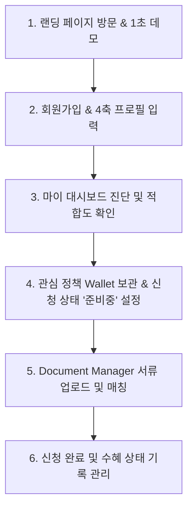
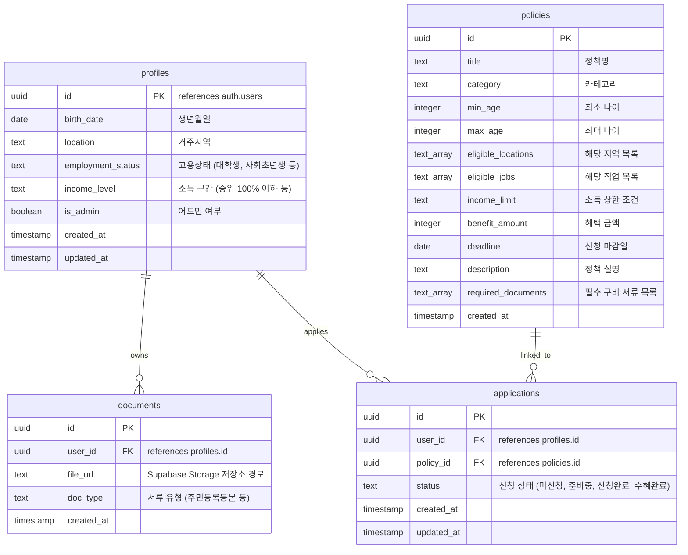

# 🏛️ PolicyFlow AI — Product Requirement Document (PRD)

## AI 기반 정책 수혜 자동화 플랫폼

* **Version**: 1.1 (MVP Completed)
* **Status**: In Progress (MVP 구현 완료 / Beta)
* **Owner**: Product Team
* **Last Updated**: 2026-05-31

---

# 1. Product Overview

## Product Vision
> **"정책을 검색하는 시대를 끝내고, AI가 개인의 프로필에 적합한 정책을 자동 매칭하여 실제 신청 및 수혜 완료까지 지원하는 원스톱 정책 수혜 자동화 플랫폼"**

사용자가 수많은 사이트를 돌아다니며 자신에게 맞는 정부·지자체 정책을 직접 검색하고 자격을 분석하는 소모적 과정을 없애고, 프로필 등록만으로 어울리는 정책을 실시간 진단하며, 필요한 서류 보관부터 진행 단계 추적까지 하나의 대시보드에서 제공합니다.

---

## Problem Statement
현재 많은 시민과 청년들이 아래와 같은 실질적인 페인 포인트를 겪으며 정책 혜택을 놓치고 있습니다:
* **정보 격차 (Discovery Gap)**: 지원받을 수 있는 좋은 정책이 존재한다는 사실 자체를 인지하지 못함.
* **자격 분석 피로도 (Eligibility Friction)**: 나이, 지역, 직업, 소득 등 파편화되고 복잡한 행정 조건으로 인해 본인이 수혜 대상인지 스스로 판단하기 극도로 어려움.
* **마감 관리 실패 (Deadline Misses)**: 정책을 발견하더라도 복잡한 일정 관리 실패로 인해 신청 마감일을 놓침.
* **서류 준비의 번거로움 (Document Overhead)**: 매 신청마다 주민등록등본, 초본, 소득 증빙 서류 등을 반복적으로 발급하고 업로드해야 하는 번거로움.

기존 정부 운영 플랫폼은 단순한 정보 제공(검색)에 치우쳐 있어, 실제 사용자의 신청 과정 완결과 지속적 사후 관리(수혜 추적)까지는 밀착 대응하지 못하고 있습니다.

---

## Solution
**PolicyFlow AI**는 사용자의 조건을 분석하는 **4축 매칭 진단 엔진**과 **클라우드 서류 보관소(Policy Wallet)**를 통합하여 이 모든 탐색 및 신청 여정을 혁신합니다.
* **정책 자격 자동 진단**: 나이, 거주지, 고용상태, 소득수준을 종합 분석하여 수혜 가능 여부 즉각 판별.
* **의미론적 고용 매칭**: "대학생"이 "사회초년생"이나 "취업준비생" 정책 요건에 걸맞은 경우, 지능적 범주 확장을 통해 조건 매칭을 보완 지원.
* **Policy Wallet**: 수혜 대상 정책을 저장하고 '미신청 ➔ 준비중 ➔ 신청완료 ➔ 수혜완료'의 4단계 라이프사이클로 체계적 관리.
* **Document Manager**: 자주 쓰이는 행정 서류를 PDF/이미지 형태로 업로드하고, 여러 정책 신청 시 간편하게 재사용.
* **Admin Dashboard & Demo**: 정책 제공자와 서비스 어드민이 실시간으로 정책 데이터를 추가/삭제하고 매칭 로직을 즉각 시뮬레이션할 수 있는 검증 도구 내장.

---

# 2. Goals

## Business Goals
### B2C (사용자 관점)
* **정책 수혜율 극대화**: 정보 부족 및 오인으로 지원금을 받지 못하던 잠재적 수혜자들의 정책 전환율 제고.
* **개인 맞춤형 라이프사이클 관리**: 연령 및 고용 상태 변화(대학생 ➔ 취업 ➔ 창업 등)에 따른 연속적 맞춤 정책 연계로 락인 효과 강화.

### B2G (정부 및 지자체 관점)
* **정책 전달 효율성 향상**: 복지 및 지원 예산의 사각지대를 최소화하고 표적 대상에게 적기에 홍보.
* **정밀한 성과 분석**: 사용자의 신청 여정 데이터를 익명화 분석하여 실제 수혜율이 떨어지는 정책의 보완점 피드백 가능.

---

## Product Goals
* **5분 내 매칭 완료**: 사용자가 회원가입 후 프로필 정보만 채우면 5분 안에 내가 받을 수 있는 총예상 수혜 금액과 대상 정책 리스트를 도출합니다.
* **원클릭 데모 체험**: 신규 가입 및 조건 입력 없이도 즉시 작동하는 데모 기능을 통해 높은 매칭 만족도를 즉시 체험시킵니다.

---

## Success Metrics

### North Star Metric
* **사용자당 발견 및 관리되는 예상 수혜 금액 (Accumulated Benefit Amount per User)**

### Key Performance Indicators (KPIs)
* **매칭 만족도**: 매칭된 정책에 대한 사용자 관심 저장률 (Wallet 추가율 40% 이상)
* **신청 전이율**: 관심 저장 정책의 '신청완료' 상태 도달율 (15% 이상)
* **서류 완결성**: Policy Wallet 등록 사용자 중 필수 서류 1개 이상 업로드 비율 (30% 이상)
* **데이터 민첩성**: 어드민 페이지를 통한 실시간 정책 데이터 수정 및 갱신 소요 시간 (1분 미만)

---

# 3. Target Users

## Primary User: 대한민국 청년 (만 19세 ~ 39세)
* **구분**: 대학생, 취업준비생, 사회초년생, 청년 소상공인
* **특징**: 정부에서 제공하는 청년 대상 복지·금융 혜택(자산형성, 월세지원, 구직활동지원 등)이 가장 많으나, 학업 및 직무 준비로 바빠서 신청 기회를 놓치는 비중이 높음.

---

## Secondary User (향후 확장 대상)
* **소상공인 및 스타트업 창업가**: 사업장 소재지와 업종별 정책 자금 매칭 요구.
* **경력단절여성 & 육아 부모**: 아동수당, 재취업 교육 바우처 등 맞춤 혜택 필요.
* **농어업인 및 고령층**: 행정 접근성이 떨어져 현장 밀착형 진단이 절실한 대상.

---

## User Pain Points & Direct Solutions

### 1. 정책 탐색 페인
* **Pain**: "매번 정부 사이트를 뒤져도 내가 신청할 수 있는 정책이 뭔지 모르겠다."
* **Solution**: **4축 기반 실시간 진단 엔진 & 대시보드** ➔ 가입 즉시 프로필 맞춤형 정책 자동 나열.

### 2. 자격 분석 페인
* **Pain**: "기준 중위소득 150% 이하, 미취업자 등 행정 기준이 복잡해서 내 소득과 고용 상태가 맞는지 헷갈린다."
* **Solution**: **의미론적 고용 매칭 및 소득구간 매핑** ➔ 대학생은 취준생 범주에, 4인 기준 소득은 백분위 매핑으로 명확히 자동 판별.

### 3. 서류 중복 제출 페인
* **Pain**: "정책 하나 신청할 때마다 등본, 서약서 등 서류를 매번 다시 준비해서 업로드하기 귀찮다."
* **Solution**: **Policy Wallet Document Manager** ➔ 암호화된 안전 스토리지에 1회 보관 후 다중 정책에 클릭 한 번으로 재사용.

### 4. 마감 기한 관리 페인
* **Pain**: "언제 신청이 시작하고 끝나는지 날짜를 잊어버려 기회를 항상 놓친다."
* **Solution**: **Deadline Guardian (일정 관리 및 알림)** ➔ D-7, D-3, D-1 자동 추적 시스템.

---

# 4. User Journey (사용자 여정)

1. **탐색 및 데모**: 사용자는 Spotify 스타일의 몰입형 랜딩 페이지에 도달합니다. 비회원 상태에서 **'1초 데모 로그인'**을 클릭해 실시간 정책 진단과 대시보드가 어떻게 작동하는지 1초 만에 확인합니다.
2. **프로필 설정**: 이메일을 통해 정식 가입한 후, **생년월일, 거주지역, 고용상태, 소득구간**을 입력/수정합니다.
3. **실시간 진단**: 대시보드에서 매칭 점수(%)와 함께 개별 조건(나이·지역·직업·소득)별 부합/미달 원인을 친절한 메시지로 파악합니다.
4. **보관 및 추적**: 원하는 정책을 **Policy Wallet**에 담고, 신청 준비 상태를 트래킹합니다.
5. **서류 준비**: 내 지갑(Wallet) 하단에서 필요한 서류를 안전하게 업로드하고 분류해 보관합니다.
6. **수혜 완결**: 실제 신청이 완료되면 상태를 '수혜완료'로 갱신하여 총 누적 수혜 혜택을 기록합니다.

---

# 5. Core Features (핵심 기능 정의)

### Feature 01: 4축 정책 매칭 진단 엔진 (Policy Diagnosis)
* **설명**: 사용자의 4대 조건(생년월일, 거주지, 고용상태, 소득수준)과 정책의 자격 요건 데이터를 대조하여 실시간 자격 적격성 판별.
* **세부 기능**:
  * **만 나이 계산**: 생년월일 기준 현재 날짜 대비 만 나이 계산 및 유효하지 않은 포맷 예외 처리.
  * **거주지 매칭**: 전국 단위 지원 정책 처리 및 지자체별(예: 인천, 서울) 부분 일치/상호 포함 매칭.
  * **의미론적 고용 확장**: 단순 텍스트 일치를 넘어 `대학생 ➔ 취업준비생 정책` 또는 `취업준비생 ➔ 사회초년생 정책` 등 하위 범주가 상위 요구 정책에 자동 대응되도록 매칭 맵 내장.
  * **소득 요건 판별**: 중위소득 구간(50% 이하, 100% 이하, 150% 이하 등) 수치화 및 정책 소득 한도 비교 연산.
* **우선순위**: P0
* **상태**: **✅ 구현 완료**

### Feature 02: 정책 적합도 추천 엔진 (Policy Recommendation Engine)
* **설명**: 단순 적격/부적격을 넘어, 정책별 사용자와의 밀접도를 백분율 점수(%)로 산출하여 지능적 정렬 제공.
* **세부 기능**:
  * **가점 알고리즘**: 거주지 제한이 좁은 지자체 로컬 정책이 전국 단위 공통 정책보다 먼저 노출되도록 점수 가중치 부여.
  * **매칭 적합도 상세 사유**: 어떤 요소(나이, 지역 등)가 패스되었는지, 미달 시 구체적인 기준(예: "만 19~34세 대상이나 현재 만 38세")을 다이내믹하게 분석해 카드뷰 내 표시.
* **우선순위**: P0
* **상태**: **✅ 구현 완료**

### Feature 03: 개인 정책 금고 (Policy Wallet)
* **설명**: 사용자가 수혜받을 타겟 정책을 저장하고 신청 여정을 트래킹하는 통합 관리 허브.
* **세부 기능**:
  * **관심 정책 저장 및 삭제**: 대시보드에서 하트/저장 버튼 클릭 시 Wallet으로 즉시 이동 및 동기화.
  * **4단계 상태 관리**: '미신청' ➔ '준비중' ➔ '신청완료' ➔ '수혜완료'의 실시간 상태 토글링 및 데이터베이스 영속성 보장.
  * **수혜 금액 대시보드**: 수혜 완료된 정책들의 혜택 금액을 모아 상단 카드에 직관적 누적 합계 표시.
* **우선순위**: P0
* **상태**: **✅ 구현 완료**

### Feature 04: 내 서류 보관소 (Document Manager)
* **설명**: 신청에 필요한 주민등록등본, 소득 증빙 등의 파일을 안전하게 업로드하고 관리하는 모듈.
* **세부 기능**:
  * **Supabase Storage 연동**: 암호화된 Storage 버킷 내 사용자별 폴더에 안전하게 파일 저장.
  * **파일 규격 지원**: PDF, PNG, JPG 파일 포맷 지원 및 업로드 완료 즉시 목록 갱신.
  * **문서 유형 분류**: 등본, 초본, 졸업증명서, 통장사본 등 서류 종류를 저장 시 메타데이터로 매핑하여 중복 재사용 지원.
* **우선순위**: P0
* **상태**: **✅ 구현 완료**

### Feature 05: 일정 알림 가디언 (Deadline Guardian)
* **설명**: 담아둔 관심 정책의 마감일을 잊지 않도록 푸시 또는 메일 형식으로 사용자에게 사전 공지.
* **세부 기능**:
  * **다단계 리마인더**: 마감 7일 전, 3일 전, 1일 전 자동 이메일 또는 카카오톡 연동 알림 (향후 백그라운드 크론 작업 배치 예정).
* **우선순위**: P0
* **상태**: **📋 예정 (V2 개발 단계 타겟)**

### Feature 06: 어드민 정책 관리 대시보드 (Admin Dashboard)
* **설명**: 어드민 전용 경로(`/admin`)를 통해 실시간으로 신규 공공 정책을 적재/수정/삭제하며, 변경된 정책이 사용자 매칭 엔진에 즉각 반영되는지 테스트하는 기능.
* **세부 기능**:
  * **실시간 CRUD**: Supabase DB와 연동하여 폼(Form) 입력만으로 정책 데이터를 안전하게 추가 및 즉시 삭제.
  * **보안 통제 (RLS 및 역할 제어)**: `profiles` 테이블의 `is_admin` 필드가 `true`인 사용자만 접근 가능하도록 사이드바 메뉴 가시성 통제 및 페이지 내 보안 검증.
* **우선순위**: P0 (관리 효율 및 데모 편의성을 위해 MVP 범위로 조기 도입)
* **상태**: **✅ 구현 완료**

### Feature 07: 1초 데모 원클릭 로그인 (One-Click Demo Login)
* **설명**: 번거로운 회원가입과 4대 조건 입력 없이도 단 1초 만에 최적화된 대시보드를 체험할 수 있는 사용자 친화적 온보딩 도구.
* **세부 기능**:
  * **데모 계정 즉석 생성**: 고유 테스터 난수를 기반으로 백엔드 인증 및 임시 프로필을 자동 주입하여 로그인 상태 구현.
  * **기본 매칭 데이터 세팅**: 청년 정책 조건에 최적화된 가상 프로필(예: 만 26세, 거주지 인천, 고용상태 대학생, 소득 중위 100%)을 자동 설정하여 완벽한 매칭 카드들을 바로 경험하게 유도.
* **우선순위**: P0
* **상태**: **✅ 구현 완료**

---

# 6. Functional & Security Requirements

## 1. Authentication (인증)
* **이메일 로그인 및 회원가입**: Supabase Auth 연동을 통한 보안성 높은 인증 토큰 처리.
* **세션 유지**: 클라이언트 사이드 쿠키 및 로컬 스토리지를 활용한 새로고침 시 로그인 상태 보존.
* **1초 테스트 로그인**: 익명/가상 계정 생성을 통해 비회원 진입 장벽 제거.

## 2. Profile Management (프로필 관리)
* **기본 정보 설정**: 사용자는 본인의 생년월일, 거주지(시/도), 고용상태, 중위소득 구간 정보를 상시 CRUD 할 수 있어야 함.
* **트리거 연동**: Supabase Auth 가입 완료와 동시에 데이터베이스 `profiles` 테이블에 동일 ID의 프로필 행이 자동으로 생성되도록 데이터베이스 트리거 작동.

## 3. Data Isolation & Security (데이터 격리 및 RLS)
* **Row Level Security (RLS) 철저 구현**:
  * `profiles` 테이블: 본인의 프로필 행만 읽기 및 쓰기(수정) 가능.
  * `documents` 테이블: 본인이 업로드한 행과 파일만 관리 가능.
  * `applications` 테이블: 본인의 신청 내역 행만 소유 및 토글 가능.
  * `policies` 테이블: 일반 사용자는 전체 읽기(Read)만 가능, 어드민 권한(`is_admin = true`)이 부여된 사용자만 쓰기/수정/삭제 가능.

---

# 7. AI Requirements (AI 연동 사양 - 로드맵 단계)

## AI Module 1: Policy Crawler & Parser
* **입력**: 정부 고시공고 HWP/PDF 원본 파일 또는 웹페이지 크롤링 텍스트.
* **출력**: 나이 범위, 주소 한계, 고용 조건, 소득 제한, 지원 혜택 금액, 필요한 구비 서류 목록이 JSON 포맷으로 추출된 구조화 데이터.
* **역할**: 수작업 등록 단계를 보완하여 어드민 대시보드에 자동 드래프트 제안.

## AI Module 2: AI Chat Advisor (정책 상담사)
* **입력**: 사용자의 자연어 질문 (예: "인천 사는데 이번 달 마감되는 청년 월세지원에 등본 말고 추가 서류 필요해?")
* **출력**: DB 내의 정책 스키마 및 업로드된 서류 상황을 결합하여 실시간 맞춤 컨설팅 응답 제공.

---

# 8. Data Model (ERD 명세)

---

# 9. MVP Scope (최종 구현 범위 정리)

| 구분 | 기능 범위 | 구현 여부 | 비고 |
| :--- | :--- | :--- | :--- |
| **인증** | 일반 이메일 가입/로그인 + **1초 원클릭 데모 로그인** | **✅ 완료** | Supabase Auth 및 가상 프로필 주입 완비 |
| **진단** | 4축 조건 비교 엔진 + **의미론적 고용 확장 판별** | **✅ 완료** | 나이/지역/직업(의미론적)/소득 완벽 지원 |
| **추천** | 적합도 점수(%) 환산 + 지자체 로컬 가점 정렬 | **✅ 완료** | UI 내 적격/부적격 사유 구체적 텍스트 표시 |
| **금고** | 관심 정책 보관 + 4단계 신청 상태 토글 | **✅ 완료** | 수혜 완료 금액 다이내믹 롤업(Roll-up) 합산 |
| **서류** | Supabase Storage 연동 PDF/이미지 업로드 및 관리 | **✅ 완료** | 내 지갑 화면 내 업로드 컴포넌트 실시간 동기화 |
| **어드민** | 정책 데이터 실시간 CRUD Dashboard (`/admin`) | **✅ 완료** | `is_admin` 컬럼 연동 사이드바 및 접근 통제 |
| **알림** | 마감일 기한 가디언 (Deadline Guardian) | **📋 V2 예정** | 배치 스케줄러 및 메일 알림 서버 연계 예정 |
| **AI** | AI 공고 파서, AI 상담 챗봇 및 문서 OCR | **📋 V2 예정** | LLM 기반 자연어 인터페이스 적용 단계 제외 |

---

# 10. Future Roadmap (향후 제품 로드맵)

* **V1 (현재 단계)**: 4축 조건 매칭 진단 엔진, 개인 정책 금고(Wallet), 서류 보관소(Storage), 데모 로그인 및 어드민 도구를 연계한 초정밀 MVP 구축 완료.
* **V2 (일정 알림 & AI 분석)**: 
  * 마감일 리마인더 알림 자동화(Deadline Guardian) 탑재.
  * AI 공고 파서 모듈 도입 ➔ 수작업 정책 추가를 반자동화로 고도화.
  * AI Policy Interpreter ➔ 복잡한 행정 문구를 알기 쉬운 원화(₩) 및 직관적 용어로 실시간 변환.
* **V3 (지능형 신청 추천 및 간소화)**:
  * Benefit Graph 적용 ➔ A 정책(예: 청년 월세지원) 수혜자에게 시너지 있는 B 정책(예: 청년도약계좌)을 선제 추천.
  * 구비서류 자동 재사용 및 자동 양식 작성 도구 지원.
* **V4 (기관용 SaaS 플랫폼 확장)**:
  * 정부 부처 및 지자체 담당자용 대시보드 ➔ 직접 정책을 올려 유입률을 모니터링하고 공공 혜택 전달률 성과를 지표화하는 B2G SaaS로 확장.

---

# 11. Key Risks & Mitigations

### 1. 정책 정보의 최신성 및 신뢰도 리스크
* **위험**: 정부 정책은 매년 상반기/하반기 또는 수시로 개정되며, 부정확한 정보 매칭 시 사용자가 자격을 오인해 불이익을 받을 수 있음.
* **대비책**: 단기적으로는 어드민 관리 대시보드(`/admin`)를 구축해 발견 즉시 10초 내 갱신할 수 있게 하였으며, 장기적으로는 AI 공고문 크롤러 및 파서를 연동하여 정부 API/고시 데이터를 실시간 감지해 변경 내용을 자동 드래프트로 어드민에게 알릴 예정.

### 2. 민감한 개인 행정 정보 보안 리스크
* **위험**: 주민등록등본, 초본, 통장 사본 등은 민감한 개인 식별 정보 및 소득 정보를 포함하므로 유출 시 큰 법적 리스크 발생.
* **대비책**: Supabase PostgreSQL의 강인한 **RLS(Row Level Security)** 정책을 100% 적용하여, 완벽한 세션 인증이 완료된 본인 이외에는 절대 서류 정보 및 프로필 데이터를 조회할 수 없도록 격리. 추가로 스토리지 보관 주기를 설정하여 수혜 완료 시 즉각 파기하는 옵션 제공 예정.

---

# 12. Definition of Success

PolicyFlow AI는 단순한 **'정책 검색 포털'**이 아닙니다.  
사용자가 그들의 정보를 사전에 정확히 매핑하여 귀찮은 정보 수집 단계를 단 **5분으로 압축**하고, 나아가 서류 보관부터 수혜 완료까지 동행하며 실제 가계 경제에 실질적 이익을 실현해 주는 **'지능형 정책 수혜 자동화 솔루션'**으로 자리매김하는 것이 성공의 정의입니다.
